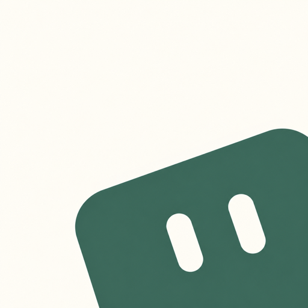
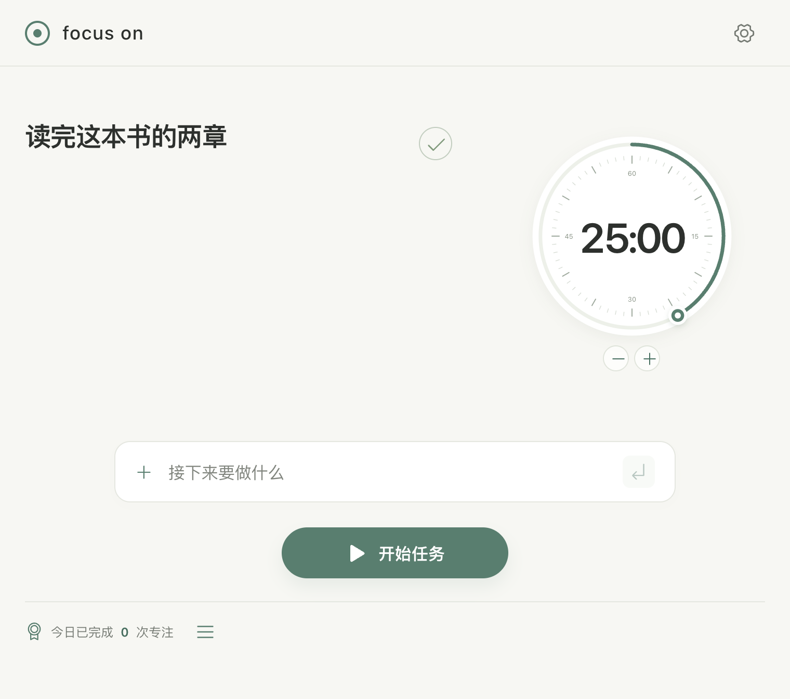
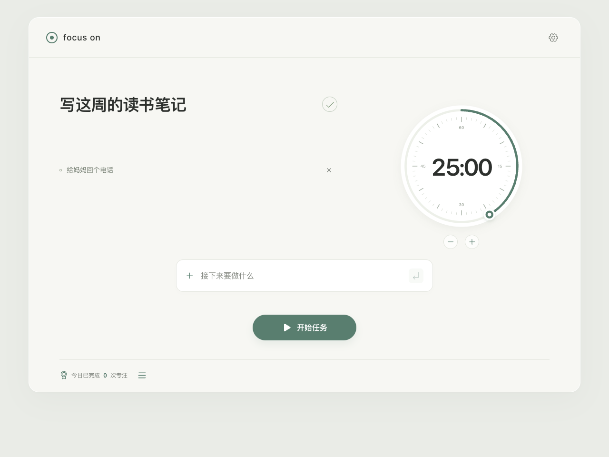
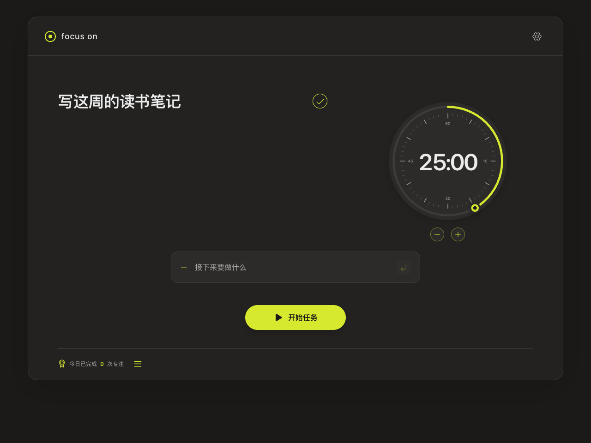
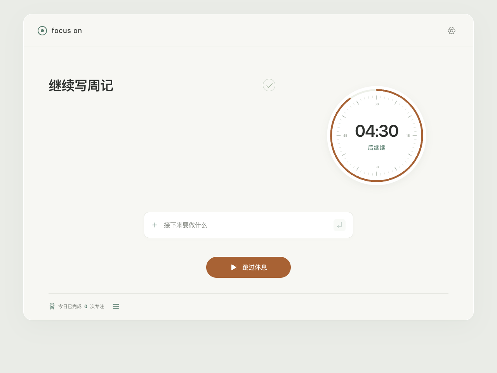
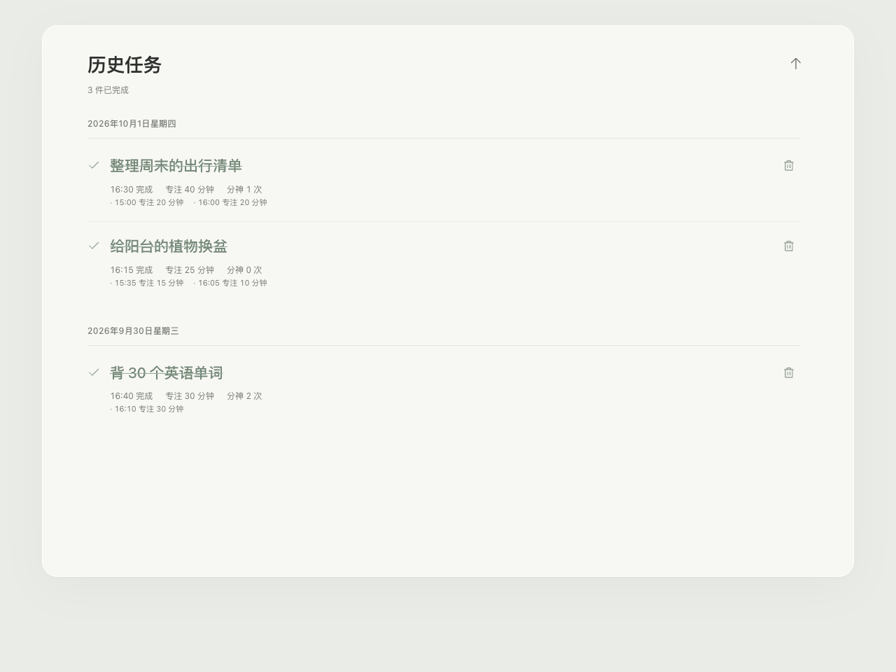
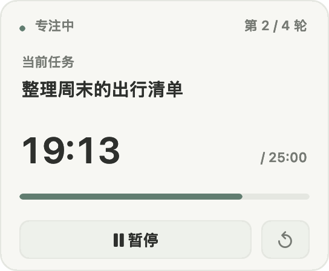
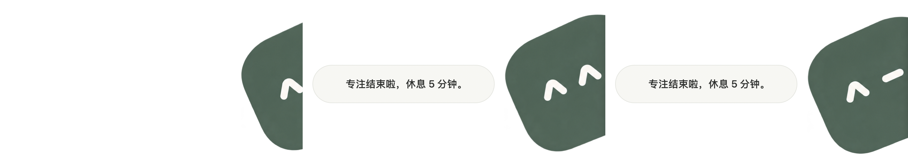

<div align="center">
  
  <h1>Focus On · 专注时刻</h1>
  <p><strong>一个安静的 macOS 专注工具：写下要做的事，转动圆盘，剩下的交给它。</strong></p>
  <p>
    
    
    
    
  </p>
</div>

<p align="center">
  
</p>

## 为什么是 Focus On

大多数番茄钟让你先学一套规则。Focus On 只做一件事：**把“接下来要做什么”放在屏幕正中央**，然后用一个可以上手转动的圆盘陪你把时间走完。任务优先、计时其次，没有账号、没有同步、没有统计焦虑——所有数据只存在这台 Mac 上。

- **任务优先**：输入任务、按下开始，时钟自动让位缩到一侧，当前任务始终是主角。
- **圆盘即时钟**：像拧计时器一样拖动圆点设定总时长；满 35 分钟自动拆成“专注 + 5 分钟休息”的节奏，每段专注不超过 25 分钟。
- **分段记录每一次投入**：计时结束但事情还没做完？专注时长照样记进任务。最终完成时，历史里能看到这件事在什么时候、专注了多久。
- **轻提醒，不打断**：进入休息、专注完成时，一只圆角小团子从屏幕边缘探出头来，笑一笑就走——不抢焦点，鼠标可以穿过它。

## 界面

<table>
  <tr>
    <td></td>
    <td></td>
  </tr>
  <tr>
    <td align="center"><sub>浅色 · 灰绿的专注</sub></td>
    <td align="center"><sub>深色 · 荧光黄绿的专注</sub></td>
  </tr>
  <tr>
    <td></td>
    <td></td>
  </tr>
  <tr>
    <td align="center"><sub>休息有自己的颜色，也可以一键跳过</sub></td>
    <td align="center"><sub>历史任务按天分组，逐段记录专注</sub></td>
  </tr>
</table>

## 常驻菜单栏

主窗口可以随时最小化到菜单栏，计时在后台继续。悬停菜单栏图标即展开紧凑面板：当前任务、第几轮、剩余时间一目了然，抬手就能暂停或继续——不用切回窗口，思路不断。

<p align="center">
  
</p>

## 分神了？宠物轻轻提醒你

开启摄像头专注提醒后，Focus On 在本机用头部姿态与近似视线判断你是否持续偏离屏幕。偏离几秒后，小团子探出头来看着你；回看屏幕，它便悄悄退下。进入休息或完成专注时，它也会斜着探出来报信：

<p align="center">
  
</p>

**隐私优先**：画面只在本机实时处理，不录像、不保存、不上传；暂停、休息或结束计时，摄像头立刻关闭。它不知道你是否真的在思考，也不会判断你在不在用手机——只是一个温和的回头暗示。拒绝摄像头权限也完全不影响计时。

## 安装

**下载 DMG**：前往 [Releases](https://github.com/ChrisEvans2/focus-on/releases) 获取最新打包（Apple 芯片）。当前为本地签名测试包，未经过 Apple 公证，首次打开如被拦截，请在 系统设置 → 隐私与安全性 中选择“仍要打开”。

**从源码构建**（需要 macOS 13+ 与 Swift Command Line Tools，不需要完整 Xcode）：

```sh
npm install
npm run mac:build   # 产出 build/Focus On.app
npm run mac:open
```

也可以一行命令打出自己的 DMG：`npm run mac:dmg`。

**只想在浏览器里试试**：`npm install && npm run dev`，打开终端显示的本地地址即可使用任务与计时功能（摄像头提醒为 macOS 应用专属）。

## 技术一瞥

React 19 + TypeScript 负责界面，Swift + AVFoundation + Vision 负责本机视觉检测，全程无后台服务。35 个 Playwright 端到端测试守护计时、历史与主题行为；Swift 侧有独立的检测规则测试。

更深入的设计与实现细节：

- [交互与设计详解](docs/interaction.md) — 圆盘、队列、历史、主题等界面行为的完整说明
- [macOS MVP 文档](docs/macos-mvp.md) — 实现边界、实机验收与打包说明
- [实时视线调试](docs/gaze-debug.md) — 在真实画面上查看瞳孔与眼睑标记
- [眼动测试说明](docs/eye-test.md) — 实验性的视线采样工具
